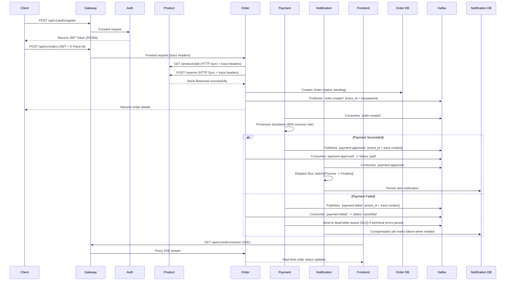

# OrderHub - Microservices Architecture

OrderHub is a robust, event-driven microservices architecture built for a distributed marketplace. It leverages PHP 8.2+, Laravel 12, MySQL 8.4 LTS, Redis, and Apache Kafka.

## About This Repository
This project is intentionally maintained as a **single monorepo** for:
- **study and learning** of microservices concepts in a practical environment;
- **demonstration** of architectural patterns (event-driven flows, queues, idempotency, tracing, realtime updates);
- **ease of understanding**, so all services, infrastructure, and frontend can be explored together end-to-end.

In production scenarios, teams may choose different repository strategies (polyrepo or segmented monorepos) depending on scale, ownership, and deployment needs.

## Features
- **Independent Microservices**: Services are completely decoupled with no cross-database access. 
- **Event-Driven**: State changes flow asynchronously via Kafka (`order.created`, `payment.approved`, `payment.failed`).
- **Synchronous Edges**: HTTP protocol is used strictly for synchronously required validations (e.g., stock availability checks before finalization).
- **Stateless Authorization**: JWT (RS256) is minted by the Auth Service, and its public key is distributed to all other microservices for local token validation via custom middleware.
- **Shared Kernel**: Common auth/event/tracing primitives are centralized in `packages/orderhub-shared`.
- **Queue Orchestration**: Notification flow uses `Bus::batch` + chain + compensation job for richer failure handling.
- **Distributed Trace Context**: `trace_id` and `traceparent` are propagated across HTTP and Kafka.
- **Real-time UX**: Orders page receives status updates via SSE (`/api/v1/orders/stream`).

## Service Structure
Each Laravel service in this monorepo follows the same base layout, with service-specific domain code:

- `app/Http/Controllers`: API entry points (request/response orchestration).
- `app/Http/Requests`: Input validation and authorization boundaries for endpoints.
- `app/Http/Middleware`: Cross-cutting concerns (JWT auth, request/trace context).
- `app/Services`: Core business use-cases and orchestration logic.
- `app/Repositories`: Data access abstraction and persistence operations.
- `app/Contracts`: Interfaces for service/repository dependencies.
- `app/Models`: Eloquent models and data casting rules.
- `app/Console/Commands`: Kafka consumers/producers and scheduled operational commands.
- `routes/api.php` and `routes/console.php`: HTTP routes and scheduled/CLI workflows.
- `database/migrations`: Service-owned schema (each service has its own database).
- `tests/Feature` and `tests/Unit`: HTTP behavior, contracts, and domain-level tests.

### Service Responsibilities
- `auth-service`: User registration/login, JWT issuance and refresh, auth rate limiting.
- `user-service`: User profile data and user-management policies.
- `product-service`: Product catalog and stock reservation source of truth.
- `order-service`: Order lifecycle, outbox publish, payment-event consumption, SSE order updates.
- `payment-service`: Payment processing simulation and payment event publishing.
- `notification-service`: Notification workflow, Horizon/queues, and payment-approved event handling.

## Event Flow Diagram


## Screenshots
<details>
<summary>Login</summary>


</details>

<details>
<summary>Create Account</summary>


</details>

<details>
<summary>Product List</summary>


</details>

<details>
<summary>Order List</summary>


</details>

## Setup Instructions

To simplify project startup, use the automated setup script:

```bash
chmod +x init-project.sh
./init-project.sh
```

The script will:
1. Configure `.env` files for all services.
2. Spin up the infrastructure (Databases, Redis, Kafka).
3. Install Composer dependencies inside the containers.
4. Generate application keys and RSA keys for JWT.
5. Execute database migrations.
6. Initialize Kafka topics.
7. Start the Gateway and Frontend.
8. **Kafka-UI**: Manage and visualize Kafka topics/messages at `http://localhost:8080`.
9. **Git Hooks**: Automatic code styling on commit.
10. **GitHub Actions**: Automated unit tests on PRs.

---

### Manual Setup (Step-by-Step)
1. Ensure Docker Desktop is running.
2. Install PHP dependencies (including `laravel/octane`) in each service. From the repo root:
   ```bash
   cd auth-service && composer install --no-interaction && cd ..
   cd user-service && composer install --no-interaction && cd ..
   cd product-service && composer install --no-interaction && cd ..
   cd order-service && composer install --no-interaction && cd ..
   cd payment-service && composer install --no-interaction && cd ..
   cd notification-service && composer install --no-interaction && cd ..
   ```
   Or run inside containers after the first `docker compose up`:  
   `docker exec orderhub-auth-service composer install --no-interaction` (and similarly for the other services).
3. In the repository root, build and deploy the infrastructure:
   ```bash
   docker compose up -d --build
   ```
4. Initialize the Databases by running migrations for each service:
   ```bash
   docker exec orderhub-auth-service php artisan migrate:fresh
   docker exec orderhub-user-service php artisan migrate:fresh
   docker exec orderhub-product-service php artisan migrate:fresh
   docker exec orderhub-order-service php artisan migrate:fresh
   docker exec orderhub-payment-service php artisan migrate:fresh
   docker exec orderhub-notification-service php artisan migrate:fresh
   ```
5. Generate RSA keys for JWT tokens:
   ```bash
   docker exec orderhub-auth-service bash -c "mkdir -p storage/keys && openssl genrsa -out storage/keys/oauth-private.key 2048 && openssl rsa -in storage/keys/oauth-private.key -pubout -out storage/keys/oauth-public.key"
   ```
   *Note: Due to Docker Volume bindings, the public key is automatically mounted into all other containers!*
6. Initialize Kafka Topics:
   ```bash
   docker exec orderhub-kafka /opt/kafka/bin/kafka-topics.sh --create --topic order.created --bootstrap-server localhost:9092
   docker exec orderhub-kafka /opt/kafka/bin/kafka-topics.sh --create --topic payment.approved --bootstrap-server localhost:9092
   docker exec orderhub-kafka /opt/kafka/bin/kafka-topics.sh --create --topic payment.failed --bootstrap-server localhost:9092
   docker exec orderhub-kafka /opt/kafka/bin/kafka-topics.sh --create --topic payment.failed.dlq --bootstrap-server localhost:9092
   ```
7. Done! Endpoints are mapped to ports `8001-8006`.
   - Kafka workers run automatically in dedicated containers: `order-consumer`, `order-outbox-publisher`, `payment-consumer`, `notification-consumer`.
   - Queue workers run with Laravel Horizon in `notification-horizon`.
   - Kafka-UI is available at `http://localhost:8080`.
   - Horizon dashboard is available at `http://localhost:8006/horizon`.

## Code Quality
This project uses **Laravel Pint** for code style consistency. A Git pre-commit hook is provided to automatically run Pint on staged PHP files.

The hook is automatically installed during the project initialization via `init-project.sh`. To install it manually, run:
```bash
chmod +x scripts/install-hooks.sh
./scripts/install-hooks.sh
```

The hook will:
1. Identify all staged PHP files.
2. Group them by their respective service.
3. Run the service-specific `vendor/bin/pint` on those files.
4. Automatically re-stage any files that were fixed by Pint.

## Laravel Octane (FrankenPHP)
All Laravel API services run with **Laravel Octane** and **FrankenPHP** for high performance: the application stays in memory between requests. Each service is served on port `8000` inside its container.

The Docker image includes FrankenPHP; the container runs Octane with file watching enabled by default in development:
`php artisan octane:start --server=frankenphp --host=0.0.0.0 --port=8000 --watch`.

You can disable auto-reload per service with:
`OCTANE_WATCH=false` in the service `.env`.

## Kafka Topic Design
To support loose coupling, Kafka topics act as the primary communication contract:
- `order.created`: Contains `order_id`, `user_id`, `amount`, `status`, `trace_id`, `traceparent`. Consumed by Payment.
- `payment.approved`: Contains `order_id`, `payment_id`, `event_id`, `occurred_at`, `trace_id`, `traceparent`. Consumed by Order and Notification.
- `payment.failed`: Contains `order_id`, `payment_id`, `event_id`, `occurred_at`, `trace_id`, `traceparent`. Consumed by Order Service.
- `payment.failed.dlq`: Dead-letter queue for persisting events failing multiple technical retries.

---

## Design Decisions
1. **JWT RS256 Validation**: Standard UUID/id validation is usually slow across networks. A central IDP (Auth Service) emits RS256 signed tokens using its private key. The public key is physically loaded into surrounding microservices, allowing them to decode and validate JWT offline. 
2. **Synchronous Stock Reservation**: The Product service operates as the absolute source of truth for inventory. Instead of a complex Saga pattern for overbooking avoidance, the Order service hits HTTP `/reserve` inside a transaction block to ensure atomic subtraction dynamically before finalizing the Order.

## Failure Handling Strategy & Idempotency
- **Idempotency**: All consumers (e.g., `KafkaConsumeOrderCommand` in Payment Service) verify if a `payment` record for the given `order_id` already exists (checking local DB) before attempting logic processing.
- **Failures & DLQ**: Simulated technical errors trigger the catch block. If exceptions are thrown in message parsing or processing, the event is redirected to a `.dlq` (Dead-letter queue) topic ensuring partition pointers can continue without choking.

## Trade-offs Made
- A shared-kernel package was introduced to reduce duplication, but it is still local to this monorepo (`packages/orderhub-shared`) instead of a separately versioned private package.
- The system mixes synchronous HTTP with asynchronous Kafka to keep ordering/stock guarantees simple; this increases coupling on critical paths.
- Docker containers run via **Laravel Octane (FrankenPHP)** for high throughput and in-memory request handling per service.

